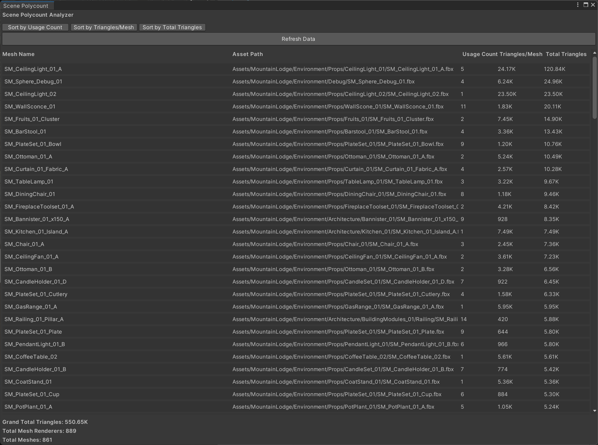
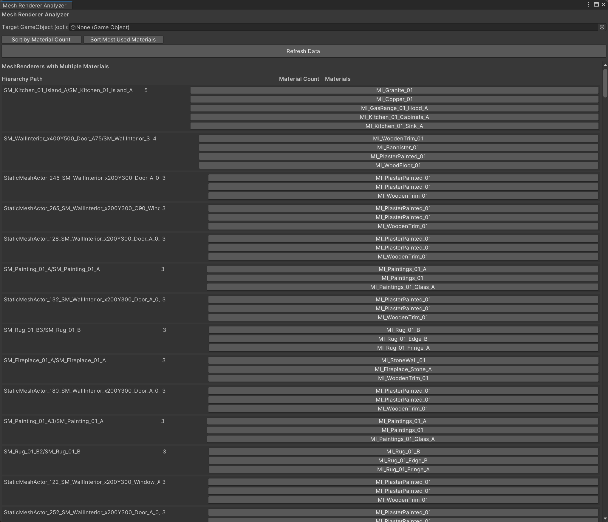
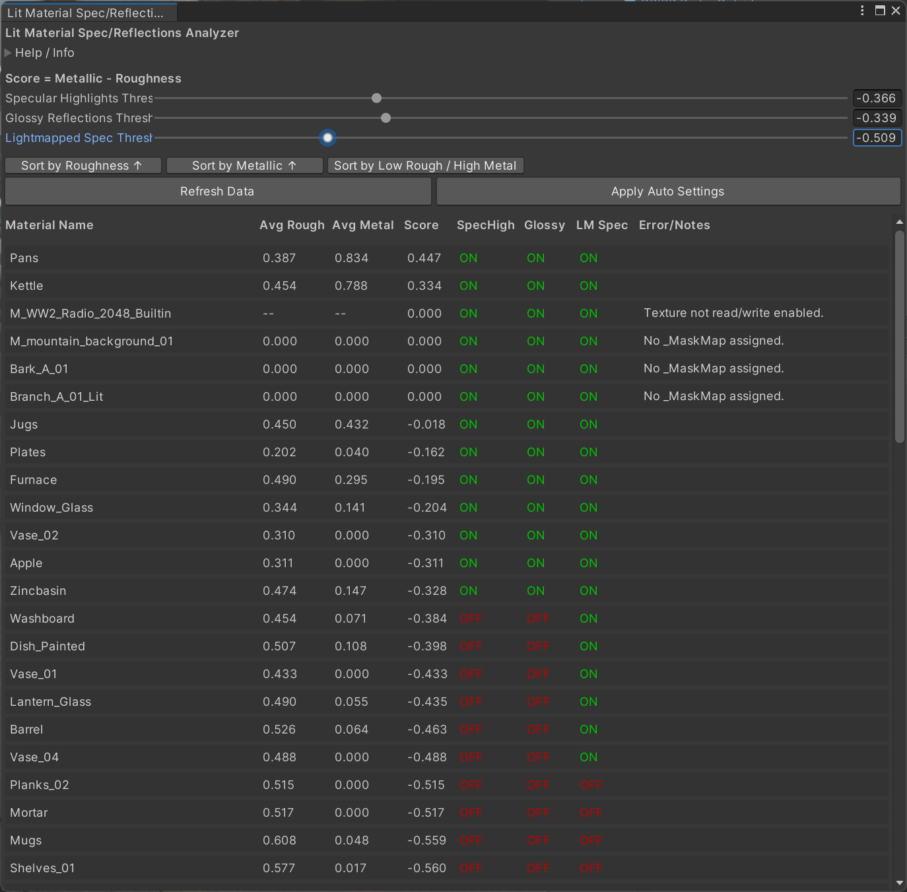

# Analysis

I made a couple of script to help me analyze unity scenes.

## Scene Polycount: [`AnalyzePolycount.cs`](../Editor/Analyze/AnalyzePolycount.cs)

This script displays a table with the poly/triangle count of all the meshes in the scene.
It allows you to sort the table by the number of instances and polycount of individual meshes or the total polycount that mesh in the scene.
This is useful to find out which meshes should probably be decimated or need LODs.

## Material Analyzer: [`AnalyzePolycount.cs`](../Editor/Analyze/MaterialAnalyzer.cs)

Small script which should help me identify materials that could be combined to reduce draw calls.

## Lit Material Analyzer: [`LitMaterialAnalyzer.cs`](../Editor/Analyze/LitMaterialAnalyzer.cs)

This script is designed to be used with the [Lit Shader from z3y](https://github.com/z3y/shaders). 
It scans the scene for Materials using a 'Lit'(Any shader that continas lit in the name) shader, reads their _MaskMap (G=Roughness, B=Metallic) to determine average values, and shows a live preview of how each Material's Specular Highlights, Glossy Reflections, and Lightmapped Specular would be toggled based on a single combined score: (Metallic - Roughness).

The goal is to optimize the materials by making them not use reflection probes or specular highlights when those would be unnoticeable.
In addition to less texture samples this would also aid in making the materials more static batchable since that could be broken by different reflection probes.
